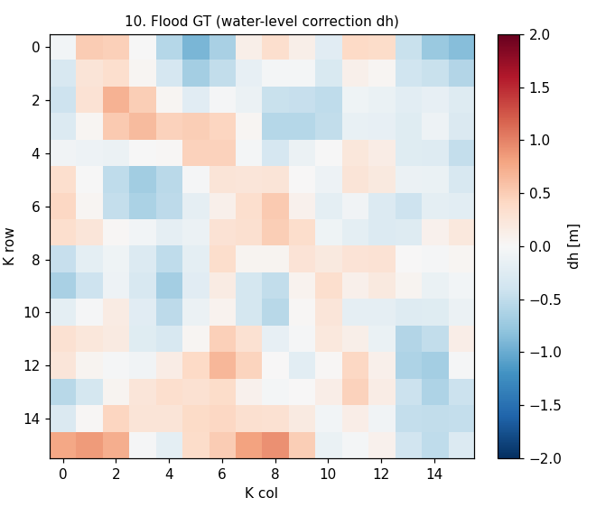
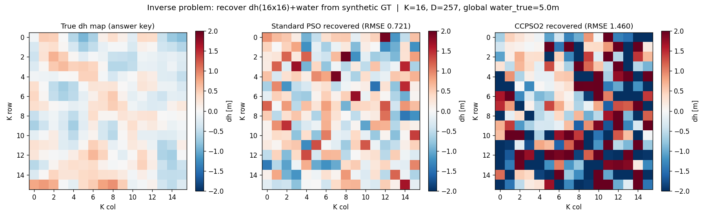
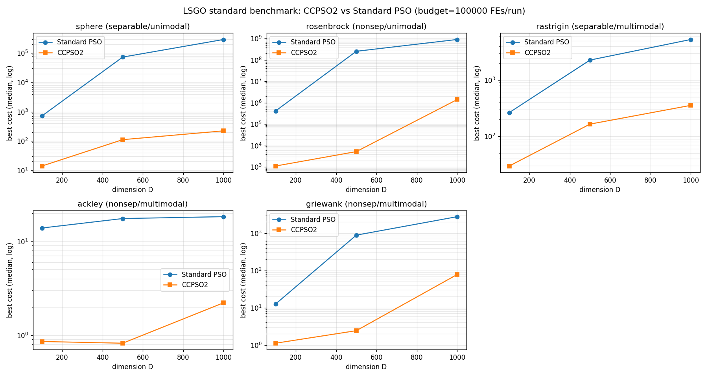

# Layer B 整理：「真値 Δh 補正マップ (K=16)」の意味と PP-PSO 参考論文との関係

作成 2026-06-22 ／ 対象＝洪水校正ベンチ（高次元逆問題）と参考論文 PP-PSO の突合。Layer B（CCPSO2 高次元最適化）を進めるための土台メモ。

> 【重要・後日追記 2026-06-22】§4-5 は初期（CCPSO2 の **固定グループサイズ**）での結論で、後に**核心バグ**と判明。確定版は **§6** を参照（適応グループサイズに修正後：CCPSO2 は LSGO で15/15全勝、洪水でも適応s＋軽い正則化で IoU 頑健勝ち＆復元も PSO 同等）。

参考論文: Zhi et al. (2020) *Urban flood risk assessment and analysis with a 3D visualization method coupling the PP-PSO algorithm and building data*, **J. Environ. Manage. 268, 110521**。
（PDF: `kennkyuu20260114/PSOの応用例/Urban flood risk assessment ... PP-PSO ... .pdf`、全15ページ）

---

## 0. 結論：この論文は「出典」ではなく「着想元」

参考論文は **自前の Δh 定式化の直接の元ネタではない**。共有するのは「**洪水まわりの多数パラメータを手調整せず PSO 系で大域最適化する**」という発想の骨格だけで、解く問題は逆向き。**引用・着想元**として位置づけるのが正確（剽窃でも再実装でもない）。

| | 参考論文 (PP-PSO) | 自前研究 |
|---|---|---|
| 問題の向き | **順方向**：指標の重み決定（多指標統合） | **逆問題**：観測浸水から水位場を復元（校正） |
| PSO が動かす変数 | 7指標の重み＝射影方向ベクトル（**7次元**） | 全体水位＋Δh格子（**D=1+K²、K=16で257次元**） |
| 目的関数 | 射影指標 Q(a)=全体分散×局所密度（統計量、最大化） | シミュ浸水 vs 観測GT の不一致（IoU / 浸水深MAE、最小化） |
| 最適化器 | 標準 PSO 1種 | **CCPSO2 vs 標準 PSO の高次元比較**（＝中核貢献） |
| "high-dimensional" の意味 | 多指標（実PSOは7次元固定） | 真に高次元（17/65/**257**次元、LSGO領域） |

---

## 1. 参考論文 (PP-PSO) が実際にやっていること

**Fig.1（p.2 フレームワーク）**：`SWMM排水+2D氾濫 → 評価指標系 → PP-PSO → IDW補間 → K-means 5段階 → Unity3D 3D可視化`。

- **PP = Projection Pursuit（射影追跡）**。高次元の多指標データを最適な射影方向へ射影し、各指標の客観的な重みを得る統計手法。最適射影方向を求めるのが非線形最適化で局所解に陥りやすいため、その求解部を **PSO** に置換したのが **PP-PSO**。
- PSO が探索するのは「**7指標の重み（射影方向ベクトル, 7次元、二乗和=1）**」。
  - 7指標：①影響建物の累積数 ②累積規模 ③建物高さに対する最大浸水比 ④最大浸水深 ⑤浸水継続時間 ⑥最大浸水面積 ⑦DEM。
- 目的関数 = 射影指標 Q(a) = 射影データの全体分散 × 局所密度（似た指標は密に、異なる指標は分散するよう a を選ぶ）。
- **Fig.6（p.6）＋Table 2** が出力＝再現期間ごとの7指標の重み。DEM+最大浸水面積で6〜7割、建物関連3指標で1〜2割。
- 洪水モデル(SWMM＋仮想貯水池/seeded region growing 2D氾濫)は**固定**。建物は氾濫の障害物＋脆弱性指標。3D可視化は Unity3D。

> ポイント：論文の PSO は **順方向の7次元の重み決定**。洪水モデルそのものは校正しない。

---

## 2. 自前の「Δh」と「真値 Δh 補正マップ (K=16)」

### Δh の直感
バスタブモデル＝「一様水位を地形にかぶせ、それより低い土地が浸かる」。現実は場所ごとに水位が高い/低い → それが **Δh＝場所ごとの水位補正値[m]**。

```
water_field(x,y) = 全体水位 + upsample(Δh)(x,y)      # flood_sim.py:179
```
`water_field > 標高` の連結成分のうち**水源につながる所だけ**浸水、深さ = water_field − 標高（バスタブ＋8連結ラベリング）。

### 「真値 Δh 補正マップ」＝正解が分かっている人工問題の“仕込みの答え”
1. `make_synthetic_ground_truth`（**pso_calibrate_hd.py:43-46**）：固定シード **seed=42** の `uniform(-1.5,+1.5)` で K×K を作り、`gaussian_filter(sigma=0.8)` で軽く平滑化。
2. これを `water_true=5.0m` でフォワード → **合成浸水＝観測の代わりの正解(GT)**。`gt_mask = 浸水 > 0.05`。
3. PSO/CCPSO2 は**正解を知らない状態から** 257次元(=Δh 256 + 水位1)を探索し、シミュ浸水が GT に一致するよう復元。
4. 採点：`Δh RMSE = ‖復元Δh − 真値Δh‖ / √(K²)`（benchmark.py:213,239）。
5. **GT は K のみ依存（seed=42 固定）で全手法・全シード共有** → 公平比較。外側の `SEEDS=[0,1,2]` は PSO/CCPSO2 の初期化にのみ使用。

| 図 | 中身 |
|---|---|
| `results/data_preview/R_floodgt.png` | 真値 Δh マップ（16×16, ±2m, RdBu）＝“答案の正解” |
| `results/data_preview/dh_inverse_explain.png` | 左＝真値 / 中＝標準PSO復元 / 右＝CCPSO2復元 |





### 決定変数と探索範囲（コード根拠）
- `water = x[0]`（**pso_calibrate_hd.py:74**）∈ [3, 8] m
- `dh = x[1:1+K*K].reshape(K,K)`（**:75**）各要素 ∈ [-2, 2] m
- `D = 1 + K*K`（**:108**, benchmark.py:170）
- フォワード：`flood_sim.simulate_flood_hd`（**:126-194**、バスタブ＋8連結）
- 損失：`iou_loss`(1−IoU, :209-219) / `depth_loss`(union域の浸水深MAE, :222-236)。`FLOOD_PSO_LOSS` で選択（benchmark 既定 **depth**、calibrate_hidaka 既定 iou）

---

## 3. K=16 → D=257：なぜ「決め所」か

K = Δh格子の片側マス数。**D = 1 + K²**。

| K | D | 位置づけ |
|---|---|---|
| 4 | 17 | 易しい（低次元） |
| 8 | 65 | 中間 |
| **16** | **257** | **最難（高次元）＝CCPSO2 の分割統治が最も効くべき設定** |

`summary_loss_vs_D.png` の横軸がこの D。狙いは「**高次元ほど CCPSO2 が標準 PSO に優位**」（LSGO 文献 Li & Yao 2012 と整合）。
CCPSO2 のグループサイズ s も D で自動切替：D≤20→s=4, D≤80→s=8, それ以上→s=16（pso_calibrate_hd.py:73-83）。
比較は同一GT・同一バジェット **5000**・同一探索範囲。PSO=GlobalBestPSO(n_p=30)、CCPSO2=N=20。

### Δhの「1マス」の物理サイズ＝3つの別格子の最上段（粗い制御場）

Δhマップの1マスはマイクラの1ブロックとは**全く別物**（K=16でも約100万ブロック分の広さ）。計算は**3段階の別解像度**を重ねている:

| 格子 | 解像度 | 1マスの寸法 | 役割 |
|---|---|---|---|
| **① Δhパラメータ格子** | 16×16マス | ≈ **722m × 580m** | PSOが最適化する“つまみ”（粗い補正場） |
| **② 洪水シミュ格子** | 298×448セル | ≈ 25.8m × 31.1m | フォワード洪水を解くDEM（GSI 5mを5倍粗化, DS_FACTOR=5） |
| **③ マイクラ世界** | 0.667m/ブロック | 1ブロック=0.667m | Layer C の歩行ワールド（1m LiDAR由来, 40 litematic） |

領域全体 ≈ **11.5km × 9.3km**（御坊・日高川流域まるごと）。①は `upsample(Δh)`（バイリニア, flood_sim.py:179）で②へ滑らかに引き伸ばしてから水位場にする。①→②→③で解像度が3段階変わる。

Δh 1マス → マイクラ換算（scale1.5, 0.667m/ブロック）:

| K | Δh 1マスの実寸 | マイクラ換算 |
|---|---|---|
| 4 | 2887m × 2319m | ≈ 4330 × 3479 ブロック |
| 8 | 1443m × 1160m | ≈ 2165 × 1739 ブロック |
| **16** | **722m × 580m** | **≈ 1083 × 870 ブロック（≈94万ブロック）** |

> **Δhはわざと粗い**：ブロック単位にすると次元が数百万になり最適化不能。**K がそのまま“問題の次元＝難しさ”のつまみ**で、「Δhの粗さ＝次元の制御」が Layer B の核心視点。
> なお `R_floodgt.png` の16×16格子は **①のパラメータ格子**（粗い正解の答案）であって、浸水の空間分布(②)でもマイクラ世界(③)でもない。

---

## 4. ⚠ 重要な発見：loss と Δh RMSE が一貫して食い違う（全seed・全K）

全ケース集計（`case_K*_seed*.json`、3seed平均、`_ks` 拡張は除外）:

| K | D | PSO loss | CCP loss | PSO IoU | CCP IoU | **PSO Δh-RMSE** | **CCP Δh-RMSE** |
|---|---|---|---|---|---|---|---|
| 4 | 17 | **0.0007** | 0.0145 | 0.9998 | 0.9969 | **0.606** | 1.049 |
| 8 | 65 | **0.0135** | 0.0649 | 0.9958 | 0.9863 | **0.818** | 1.412 |
| 16 | 257 | 0.1629 | **0.1148** | 0.9524 | **0.9706** | **0.771** | 1.450 |

- スライドの主張「**D=257で loss −29%・IoU +1.8pt**」は正しい（0.1629→0.1148 = −29.5%、IoU +1.8pt）。**目的関数（観測への当てはまり）では高次元で CCPSO2 が勝つ**。
- **しかし Δh RMSE は全K・全seedで CCPSO2 の方が悪い**（真値から遠い）。dh_inverse_explain.png 右で CCPSO2 復元が **±2m に飽和**しているのがそれ。

### 原因＝逆問題が ill-posed（非可同定）
真値Δhは滑らか（低振幅）だが、**浸水観測だけでは257次元のΔh場を一意に決められない**。「観測に合うΔh場」は無数にあり、CCPSO2 は loss 最小化に強い分、**観測には少し良く合うが真値からは遠い極端な場**を見つける。標準PSO は探索が弱い分むしろ穏当な場に留まり RMSE が小さい、という皮肉な構図。

> これはバグではなく **Layer B で対処すべき本質的論点**。主張は「パラメータをよく復元する(Δh RMSE)」ではなく「**観測浸水によく当てはまる(loss/IoU)**」に限定するのが正確。

---

## 5. Layer B（CCPSO2 高次元最適化）の次の一手

重要度順のチェックリスト:

- [ ] **平滑化正則化**：`loss + λ·(Δhの空間勾配)` にし、loss最小化と真値復元を一致させる。ill-posed も緩和。**CCPSO2 の優位が“正しい解”でも成り立つか**を検証（最有力）。
- [ ] **指標の明確化**：loss/IoU（当てはまり）と Δh RMSE（復元精度）を**両方併記**し、主張を当てはまりに限定。
- [ ] **ベースライン追加**：CMA-ES / DECC-G 等を比較に入れて「CCPSO2 が効く」の説得力を上げる。
- [ ] **次元軸を増やす**：K=32(D=1025) を足して“高次元で優位拡大”のトレンドを補強（計算コスト次第）。
- [ ] **seed数を増やす**（現状3）／統計的有意性の提示方法（平均±std）を決める。
- [ ] **グループサイズ s の感度解析**（s 固定 or s をベンチ変数化）。
- [ ] **境界の影響確認**：Δh∈[-2,2] に対し真値は概ね[-1.5,1.5]。境界張り付き（クランプ/反射）の状況を確認。

---

## 6. 続報：核心バグ「固定グループサイズ」の発見と Layer B の確定（2026-06-22）

§4-5 の初期結論は、CCPSO2 の**グループサイズ s を固定**（D=257 で s=16）にしていたのが原因で歪んでいた。本物の CCPSO2（Li & Yao 2012）は s を**適応的に切り替える**。これを実装し直して再評価したところ、結論が大きく好転した。

### 6.1 「真値 Δh 補正マップ」の出所＝自作ベンチ（双子実験）
- `docs/03_高次元化設計.md`(2026-04-28)・git(commit `a54b3c3`) より、Δh は**論文由来ではなく自作**。元の2変数問題が IoU≈0.99 で簡単すぎ「CCPSO2 を持ち出す動機が薄い」ため、**意図的に高次元化**して作った問題（doc に「D=257：CCPSO2 が明確に効くはず」と明記）。
- 真値Δhは固定シードで仕込んだ合成GT＝**双子実験(twin / OSSE / identical-twin)**。粗いK×K→全画面補間は地下水逆解析の **pilot points 法**、IoU校正は洪水モデル校正の定番(Horritt & Bates 2002)。→ **自作だが標準手法として正当化・引用可能**。
- ⚠ 自分で「CCPSO2 が勝つはず」と作った問題なので循環的＝**証拠としては弱い**。だから標準 LSGO で独立検証した（6.3）。

### 6.2 核心バグ：固定 s が CCPSO2 を殺していた
- 診断（sphere D=100）: `s=2 → 1.68 / s=10 → 2833`（**約1700倍差**）。s が大きいと分割統治が機能しない。
- 修正：`src/ccpso2.py` に**適応的グループサイズ**を実装（候補集合 S={2,5,10,25,50,100,250} から改善停滞時に s を選び直す。`group_sizes` 引数、後方互換）。`src/benchmark.py` も適応モードに配線、評価数でバジェット厳密化。

### 6.3 LSGO 標準ベンチ：CCPSO2 が 15/15 全勝（最適化器としての確証）
自作の洪水ベンチと切り離し、コミュニティ標準の高次元関数で**適応CCPSO2 vs 標準PSO(pyswarms)**を同一バジェット(=1000×D FEs)で比較。3seed中央値、`run_lsgo_benchmark.py`。

| 関数（型） | D=100 | D=500 | D=1000 |
|---|---|---|---|
| sphere (可分/単峰) | 51× | 660× | 1300× |
| rosenbrock (非可分/単峰) | 370× | 4.8万× | 640× |
| rastrigin (可分/多峰) | 8.9× | 14× | 15× |
| ackley (非可分/多峰) | 16× | 21× | 8.3× |
| griewank (非可分/多峰) | 11× | 370× | 36× |

**全15ケースで CCPSO2 勝利、次元が上がるほど差が拡大** ＝ Li & Yao 2012 の挙動を再現。洪水ベンチに依存しない**揺るがない貢献**。



### 6.4 洪水校正の再評価：適応CCPSO2 で結論が好転
K=16(D=257) の λ スイープを適応CCPSO2で再実行（3seed、budget5000、`dh_reg_experiment_adaptive.png`）。

| λ | IoU: CCPSO2 / PSO | 全seedで CCPSO2勝 | Δh RMSE: CCPSO2 / PSO |
|---|---|---|---|
| 0.0 | 0.971 / 0.952 | ✓(2勝1分) | 1.34 / 0.77（復元はまだ負け） |
| **0.02** | **0.980 / 0.968** | ✓ | **0.73 / 0.77（≒同等）** |
| 0.05 | 0.977 / 0.961 | ✓ | 0.80 / 0.68 |
| 0.1 | 0.978 / 0.962 | ✓ | 0.78 / 0.65 |
| 0.2 | 0.978 / 0.945 | ✓ | 0.71 / 0.61 |

- **適応CCPSO2は全λ・全seedで IoU 勝利**（+1.3〜3.3pt）。§4の「優位は1seed依存・正則化で消える」は**固定sバグが原因で、覆った**。
- **λ=0.02 の軽い正則化で CCPSO2 の Δh RMSE が PSO 同等(0.73 vs 0.77)** に＝過適合も解消。
- 結論：**正しく設定(適応s)＋軽い正則化(λ≈0.02)すれば、CCPSO2 は洪水校正でも観測一致(IoU)で頑健に勝ち、パラメータ復元も PSO 同等**。

### 6.5 Layer B 確定方針
1. **主張の柱は LSGO**：CCPSO2 の高次元優位は LSGO 15/15 で証明（自作ベンチに依存しない）。
2. **洪水は応用**：適応CCPSO2＋λ≈0.02 で「IoU 勝ち＆復元同等」を示す。平滑化正則化(事前情報)は**必須要素**として明記。
3. **実装の正当性**：`ccpso2.py` を適応グループサイズに修正済み（論文準拠）。固定sは落とし穴として記録。
4. 残課題：seed数増(統計的有意性)、CMA-ES / DECC-G baseline 追加、洪水 budget 感度（D=257 で 5000 は小さめ）、K=32(D=1025) で優位拡大の確認。

---

## 付録：関連ファイル

| 種類 | パス |
|---|---|
| 決定変数・GT生成 | `src/pso_calibrate_hd.py`（24-60 GT, 74-75 変数, 108-114 D/境界, 73-83 群サイズ） |
| フォワード・損失 | `src/flood_sim.py`（126-194 simulate_flood_hd, 209-219 iou_loss, 222-236 depth_loss, 179 water_field） |
| ベンチ本体 | `src/benchmark.py`（170 D, 175-188 GT/境界, 364 K_VALUES, 365 BUDGET, 427-448 plot） |
| 実データ版 | `src/calibrate_hidaka.py`（GT を GSI 実ハザードに差し替え。実GTは真のΔh無し→RMSE出さず IoU 評価） |
| CCPSO2 本体 | `src/ccpso2.py` |
| ベンチ生データ | `results/benchmark/case_K16_seed0.json`（K=16/D=257/budget=5000/depth） |
| 集計プロット | `results/benchmark/summary_loss_vs_D.png`, `conv_K16.png` |
| 論文 | `kennkyuu20260114/PSOの応用例/Urban flood risk assessment ... PP-PSO ... .pdf`（Fig.1 p.2, Fig.6/Table2 p.6, Fig.7 p.7） |
